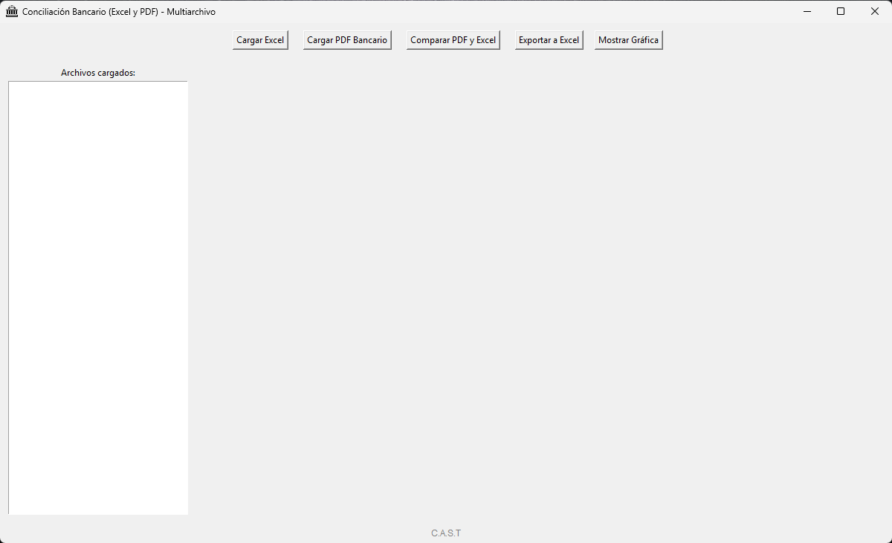
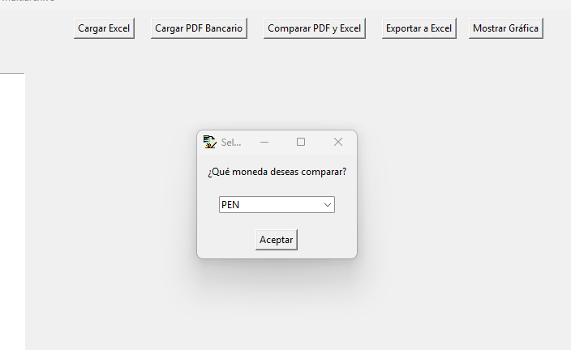
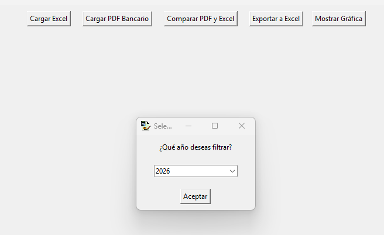
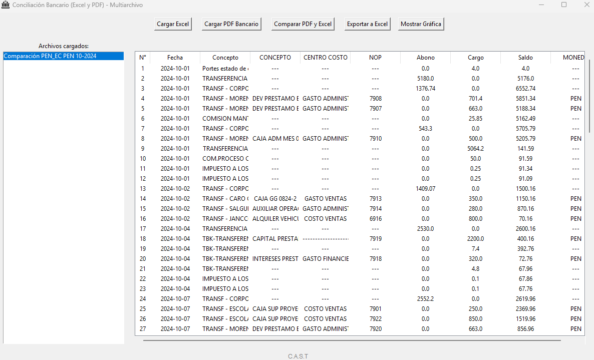
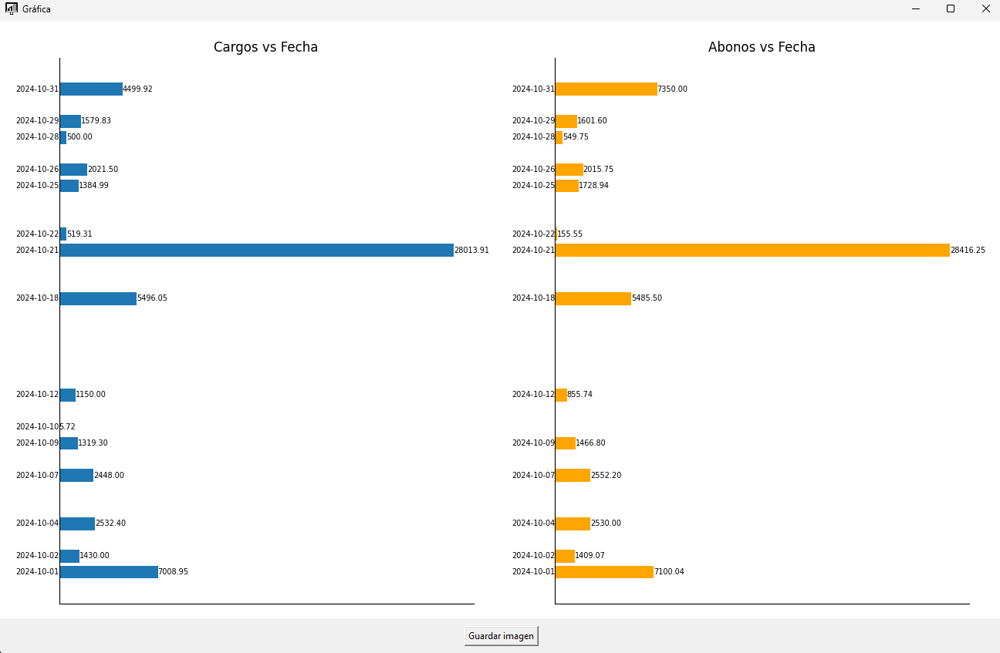

# 🏦 Conciliador Bancario Automatizado con Interfaz Gráfica

Este software permite analizar, conciliar y visualizar extractos bancarios en PDF comparándolos con registros contables en Excel. Ofrece una interfaz amigable, análisis automático de datos, filtrado por moneda y año, y generación de gráficos personalizados.

---

## 📌 Características Principales

- 🧾 Lectura automática de extractos bancarios en **PDF** (`pdfplumber`)
- 📊 Limpieza, tipado y procesamiento de datos contables en **Excel** (`pandas`)
- 🕵️‍ Comparación automática entre PDF y Excel con filtrado por moneda y año
- 📉 Detección de errores de saldo, montos duplicados, y cambios anómalos
- 📈 Visualización de resultados en tabla y gráficos
- 📤 Exportación de resultados a Excel (.xlsx)
- 🧩 Interfaz gráfica amigable con `Tkinter`
- 📦 Empaquetado como `.exe` listo para Windows

---

## 🖼️ Vista previa de la aplicación

### 🔹 Ventana principal


### 🔹 Carga de archivos y botones


### 🔹 Selección de moneda y año



### 🔹 Ventana principal final


### 🔹 Visualización de gráficas


---

## 🧠 Ejemplos de limpieza y procesamiento de datos

### 🧹 Extracción desde PDF con expresión regular

```python
pattern = re.compile(
    r"(?P<FechaOper>\d{2}/\d{2})\s+"
    r"(?P<FechaValor>\d{2}/\d{2})\s+"
    r"(?P<Origen>\d{3})\s+"
    r"(?P<Concepto>.+?)\s+"
    r"(?P<Referencia>\d{7,}|0000)?\s*"
    r"(?P<Monto>\d{1,3}(?:,\d{3})*\.\d{2})?\s*"
    r"(?P<Saldo>\d{1,3}(?:,\d{3})*\.\d{2})"
)
```

### 🧮 Determinación de cargo o abono por lógica contable

```python
if len(montos) == 1:
    if saldo_anterior is not None:
        if saldo > saldo_anterior:
            abono = montos[0]
        else:
            cargo = montos[0]
    else:
        cargo = montos[0]
```

### 📅 Creación de columna Fecha desde columnas separadas

```python
df_base['Fecha'] = pd.to_datetime(
    df_base.rename(columns={'ANO': 'year', 'MES': 'month', 'DIA': 'day'})[['year', 'month', 'day']]
).dt.date
```
### 🔍 Lógica de detección de inconsistencias

```python
# Paso 1: Coincidencias exactas de Saldo con NOP diferentes
bloques_1 = []
for i in range(len(filtro) - 1):
    if filtro['Saldo'].iloc[i] == filtro['Saldo'].iloc[i + 1]:
        if filtro['NOP'].iloc[i] != filtro['NOP'].iloc[i + 1]:
            fila = filtro[filtro['Saldo'] == filtro['Saldo'].iloc[i]]
            bloques_1.append(fila)
total = pd.concat(bloques_1)

# Paso 2: Bloques repetidos con mismo Saldo pero NOP diferente
bloques_2 = []
for i in range(len(total) - 1):
    if total['Saldo'].iloc[i] == total['Saldo'].iloc[i + 1]:
        if total['NOP'].iloc[i] != total['NOP'].iloc[i + 1]:
            mask = (total['NOP'] == total['NOP'].iloc[i]) & (total['Saldo'] == total['Saldo'].iloc[i])
            bloques_2.append(total[mask])

# Paso 3: Cambios de saldo entre operaciones con NOP diferente
cambios_saldo = []
for i in range(len(total) - 2):
    if total['Saldo'].iloc[i] != total['Saldo'].iloc[i + 1]:
        if total['NOP'].iloc[i] != total['NOP'].iloc[i + 1]:
            if i + 2 < len(total):
                mask = (total['NOP'] == total['NOP'].iloc[i]) & (total['Saldo'] == total['Saldo'].iloc[i + 2])
            cambios_saldo.append(total[mask])
```

### 🧾 Resultado final depurado
```python
combine = pd.concat(bloques_2).drop_duplicates(subset=["Saldo", "NOP"], keep="first")

combined_dfa = pd.concat(cambios_saldo).drop_duplicates(subset=["Saldo", "NOP"], keep="first")

tabla_unica = pd.concat([combine, combined_dfa]).sort_index()
```
---

## ⚙️ Instalación

1. Clona este repositorio o descarga el `.zip`
2. Instala las dependencias:

```bash
pip install -r requirements.txt
```

3. Ejecuta el software:

```bash
python main.py
```

---

## 🗂 Estructura del Proyecto

```
conciliador-bancario/
│
├── main.py                    # Lógica principal y arranque de app
├── requirements.txt
├── README.md
│
├── core/
│   ├── pdf_parser.py
│   ├── excel_loader.py
│   ├── comparador.py
│   └── utilidades.py
│
├── gui/
│   ├── ventana.py
│   ├── componentes.py
│   └── graficos.py
│
├── data/
│   └── extracto_demo.pdf
├── docs/
│   ├── ventana_principal.png
│   ├── botones_carga.png
│   ├── seleccionadores.png
│   └── grafica_cargos_abonos.png
└── export/
    └── archivos generados
```

---

## 📦 Versión Ejecutable

Puedes descargar la versión `.exe` para Windows aquí:  
👉 [Agregar enlace de Google Drive aquí]

No requiere instalación de Python.

---

## 📫 Contacto

Desarrollado por: **Carlos Adrian Salguero Torres**  
📧 adriansalguero.t@gmail.com  
🔗 [https://www.linkedin.com/in/adr-salg-t/](https://www.linkedin.com/in/adr-salg-t/)

---

## 📝 Licencia

Este proyecto está bajo la licencia MIT.
